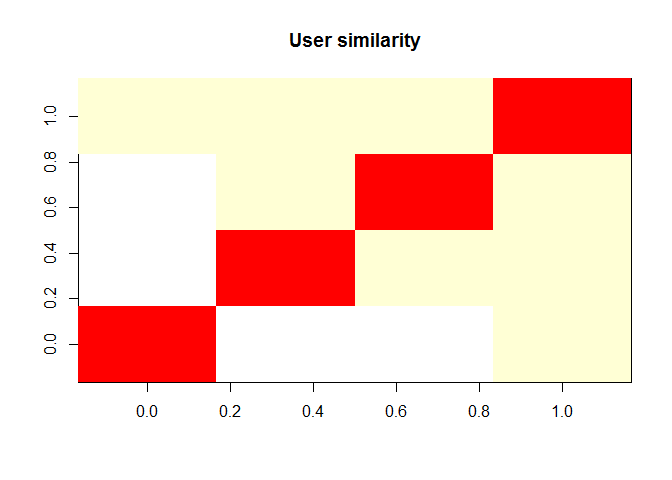
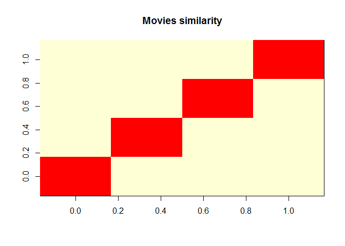
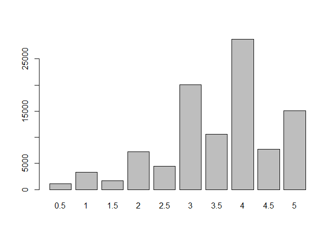
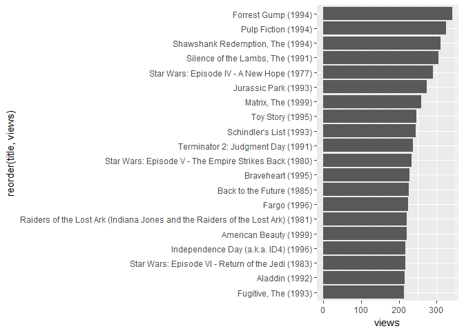
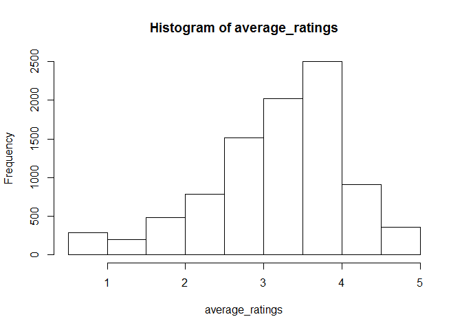
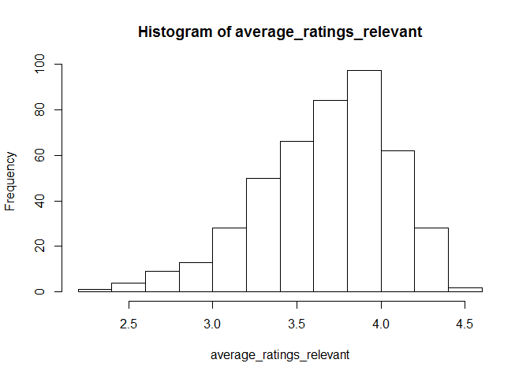
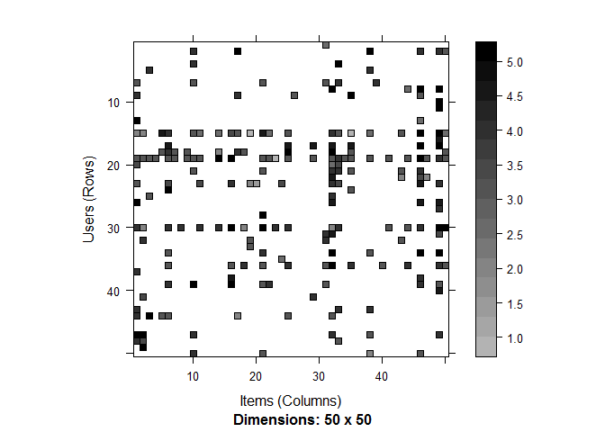
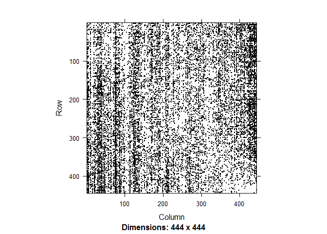
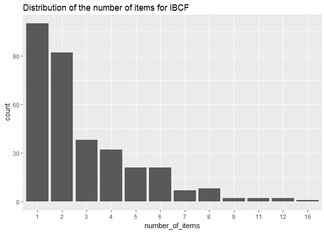
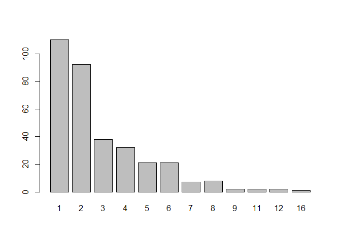

Movie Recommender Engine
================

``` r
library(recommenderlab)
library(ggplot2)
library(data.table)
library(reshape2)

movies = read.csv("D:/datasets/recommendation system/movies.csv",stringsAsFactors=FALSE)

ratings = read.csv("D:/datasets/recommendation system/ratings.csv")

summary(movies)
```

    ##     movieId          title              genres         
    ##  Min.   :     1   Length:9125        Length:9125       
    ##  1st Qu.:  2850   Class :character   Class :character  
    ##  Median :  6290   Mode  :character   Mode  :character  
    ##  Mean   : 31123                                        
    ##  3rd Qu.: 56274                                        
    ##  Max.   :164979

``` r
summary(ratings)
```

    ##      userId       movieId           rating        timestamp        
    ##  Min.   :  1   Min.   :     1   Min.   :0.500   Min.   :7.897e+08  
    ##  1st Qu.:182   1st Qu.:  1028   1st Qu.:3.000   1st Qu.:9.658e+08  
    ##  Median :367   Median :  2406   Median :4.000   Median :1.110e+09  
    ##  Mean   :347   Mean   : 12549   Mean   :3.544   Mean   :1.130e+09  
    ##  3rd Qu.:520   3rd Qu.:  5418   3rd Qu.:4.000   3rd Qu.:1.296e+09  
    ##  Max.   :671   Max.   :163949   Max.   :5.000   Max.   :1.477e+09

``` r
str(movies)
```

    ## 'data.frame':    9125 obs. of  3 variables:
    ##  $ movieId: int  1 2 3 4 5 6 7 8 9 10 ...
    ##  $ title  : chr  "Toy Story (1995)" "Jumanji (1995)" "Grumpier Old Men (1995)" "Waiting to Exhale (1995)" ...
    ##  $ genres : chr  "Adventure|Animation|Children|Comedy|Fantasy" "Adventure|Children|Fantasy" "Comedy|Romance" "Comedy|Drama|Romance" ...

``` r
str(ratings)
```

    ## 'data.frame':    100004 obs. of  4 variables:
    ##  $ userId   : int  1 1 1 1 1 1 1 1 1 1 ...
    ##  $ movieId  : int  31 1029 1061 1129 1172 1263 1287 1293 1339 1343 ...
    ##  $ rating   : num  2.5 3 3 2 4 2 2 2 3.5 2 ...
    ##  $ timestamp: int  1260759144 1260759179 1260759182 1260759185 1260759205 1260759151 1260759187 1260759148 1260759125 1260759131 ...

Data pre processing
===================

``` r
genres <- as.data.frame(movies$genres, stringsAsFactors=FALSE)

genres2 <- as.data.frame(tstrsplit(genres[,1], '[|]', 
                                   type.convert=TRUE), 
                         stringsAsFactors=FALSE)
genre_list = c(unique(genres2[,1]),unique(genres2[,2]),unique(genres2[,3]),unique(genres2[,4]),unique(genres2[,5]),unique(genres2[,6]),unique(genres2[,7]),unique(genres2[,8]),unique(genres2[,9]),unique(genres2[,10]))

genre_list = unique(genre_list)
genre_list = genre_list[-c(19,20,21)]

genre_matrix <- matrix(0,9126,18)
genre_matrix[1,] <- genre_list
colnames(genre_matrix) <- genre_list

#iterate through matrix
for (i in 1:nrow(genres2)) {
  for (c in 1:ncol(genres2)) {
    genmat_col = which(genre_matrix[1,] == genres2[i,c])
    genre_matrix[i+1,genmat_col] <- 1
  }
}

genre_matrix2 <- as.data.frame(genre_matrix[-1,], stringsAsFactors=FALSE)

for (c in 1:ncol(genre_matrix2)) {
  genre_matrix2[,c] <- as.integer(genre_matrix2[,c])  #convert from characters to integers
} 

#Creating a search matrix with movies, id and genres matrix

search_matrix <- cbind(movies[,1:2], genre_matrix2)

#Create ratings matrix. Rows = userId, Columns = movieId
ratingmat <- dcast(ratings, userId~movieId, value.var = "rating", na.rm=FALSE)
ratingmat <- as.matrix(ratingmat[,-1]) #remove userIds
```

``` r
#Convert to a rating matrix
ratingmat <- dcast(ratings, userId~movieId, value.var = "rating", na.rm=FALSE)
ratingmat <- as.matrix(ratingmat[,-1])

#Convert rating matrix into a recommenderlab sparse matrix
ratingmat <- as(ratingmat, "realRatingMatrix")
ratingmat
```

    ## 671 x 9066 rating matrix of class 'realRatingMatrix' with 100004 ratings.

``` r
#recommender_models <- recommenderRegistry$get_entries(dataType = "realRatingMatrix")
#names(recommender_models)
#lapply(recommender_models, "[[", "description")

#recommender_models$IBCF_realRatingMatrix$parameters
#recommender_models$UBCF_realRatingMatrix$parameters
```

-   Similarity measures available - cosine, pearson, and jaccard.

``` r
similarity_users <- similarity(ratingmat[1:4, ], 
                               method = "cosine", 
                               which = "users")
as.matrix(similarity_users)
```

    ##           1         2         3         4
    ## 1 0.0000000        NA        NA 0.9085757
    ## 2        NA 0.0000000 0.9556143 0.9627467
    ## 3        NA 0.9556143 0.0000000 0.9752314
    ## 4 0.9085757 0.9627467 0.9752314 0.0000000

``` r
image(as.matrix(similarity_users), main = "User similarity")
```



``` r
similarity_items <- similarity(ratingmat[, 1:4], method =
                                 "cosine", which = "items")
as.matrix(similarity_items)
```

    ##           1         2         3         4
    ## 1 0.0000000 0.9633071 0.9269097 0.9321358
    ## 2 0.9633071 0.0000000 0.9514238 0.9478533
    ## 3 0.9269097 0.9514238 0.0000000 0.9396185
    ## 4 0.9321358 0.9478533 0.9396185 0.0000000

``` r
image(as.matrix(similarity_items), main = "Movies similarity")
```



``` r
vector_ratings <- as.vector(ratingmat@data)
unique(vector_ratings) # what are unique values of ratings
```

    ##  [1] 0.0 3.0 4.0 5.0 2.0 3.5 1.0 2.5 4.5 1.5 0.5

``` r
table_ratings <- table(vector_ratings) # what is the count of each rating value
table_ratings
```

    ## vector_ratings
    ##       0     0.5       1     1.5       2     2.5       3     3.5       4 
    ## 5983282    1101    3326    1687    7271    4449   20064   10538   28750 
    ##     4.5       5 
    ##    7723   15095

``` r
vector_ratings <- vector_ratings[vector_ratings != 0] # rating == 0 are NA values
vector_ratings <- factor(vector_ratings)

plot(vector_ratings)
```

 - The most common rating is 5.

``` r
library(dplyr)
views_per_movie = colCounts(ratingmat)
table_views = data.frame(movie = names(views_per_movie),
                          views = views_per_movie)
table_views = table_views %>% arrange(-views)
table_views$title <- NA

for (i in 1:9066)
  {
  table_views[i,3] <- as.character(subset(movies, 
                                         movies$movieId == table_views[i,1])$title)
}

ggplot(table_views[1:20, ], aes(x = reorder(title,views), y = views)) +
  geom_bar(stat="identity") + coord_flip()
```



``` r
average_ratings <- colMeans(ratingmat)

hist(average_ratings)
```



``` r
average_ratings_relevant <- average_ratings[views_per_movie > 50] # we select only those movies which have been watched atleast 50 times.
hist(average_ratings_relevant)
```



Visulaizing the rating matrix
=============================

``` r
image(ratingmat, main = "Heatmap of the rating matrix")
```


``` r
image(ratingmat[1:50,1:50])
```



-   we see that some users have seen very less no of movies or some movies have been watched by very few peole. So, we will set a threshold for both equal to 50.

``` r
ratings_movies <- ratingmat[rowCounts(ratingmat) > 50,
                             colCounts(ratingmat) > 50]
```

-   we see that the no of relevant users and movies has considerably reduced.

Normaizaition
=============

-   some people give high rating to all movies. so we will normalize the average of ratings given by a single user to 0 to remove bias.

``` r
ratings_movies_norm <- normalize(ratings_movies)
```

Item based collaborative filtering
==================================

-   Here, for each two items we will measure how similar they are in terms of users giving them the same rating. we will use *cosine* similarity.
-   We will also identify the k most similar items
-   for each user we will recommend movies based on the movies he has rated.

Splitting the data into train and test
======================================

``` r
which_train = sample(x = c(TRUE, FALSE), 
                      size = nrow(ratings_movies),
                      replace = TRUE, 
                      prob = c(0.8, 0.2))


recc_data_train <- ratings_movies[which_train, ]
recc_data_test <- ratings_movies[!which_train, ]
```

Building the IBCF recommender
=============================

``` r
recc_model <- Recommender(data = recc_data_train, 
                          method = "IBCF",
                          parameter = list(k = 30, measure = 'cosine'))
```

    ## Available parameter (with default values):
    ## k     =  30
    ## method    =  Cosine
    ## normalize     =  center
    ## normalize_sim_matrix  =  FALSE
    ## alpha     =  0.5
    ## na_as_zero    =  FALSE
    ## verbose   =  FALSE

``` r
recc_model
```

    ## Recommender of type 'IBCF' for 'realRatingMatrix' 
    ## learned using 325 users.

``` r
model_details = getModel(recc_model)
model_details$description
```

    ## [1] "IBCF: Reduced similarity matrix"

``` r
model_details$k
```

    ## [1] 30

``` r
dim(model_details$sim)  # This contains a similarity matrix for movies.
```

    ## [1] 444 444

``` r
image(model_details$sim)
```



Extracting recommendations
==========================

-   For each user the algorithm extracts its rated movies. For each movie, it identifies the similar movies based on the similarity matrix.
-   Each rating is multiplied by the similarity measure. The top n recommendations are returned.

``` r
recc_predicted = predict(recc_model, newdata = recc_data_test, n = 10)

recc_predicted
```

    ## Recommendations as 'topNList' with n = 10 for 96 users.

``` r
recc_user_1 = recc_predicted@items[[1]] # recommendation for the first user
movies_user_1 = recc_predicted@itemLabels[recc_user_1]
movies_user_2 = movies_user_1
for (i in 1:10){
  movies_user_2[i] <- as.character(subset(movies, 
                                         movies$movieId == movies_user_1[i])$title)
}
movies_user_2
```

    ##  [1] "Grumpier Old Men (1995)"                                   
    ##  [2] "Little Women (1994)"                                       
    ##  [3] "Like Water for Chocolate (Como agua para chocolate) (1992)"
    ##  [4] "Lion King, The (1994)"                                     
    ##  [5] "True Lies (1994)"                                          
    ##  [6] "Executive Decision (1996)"                                 
    ##  [7] "Rock, The (1996)"                                          
    ##  [8] "Maltese Falcon, The (1941)"                                
    ##  [9] "Sting, The (1973)"                                         
    ## [10] "Manhattan (1979)"

``` r
recc_matrix <- sapply(recc_predicted@items, 
                      function(x){ as.integer(colnames(ratings_movies)[x]) }) # matrix with the recommendations for each user
```

``` r
number_of_items <- factor(table(recc_matrix))

chart_title <- "Distribution of the number of items for IBCF"
qplot(number_of_items) + ggtitle(chart_title)
```



``` r
number_of_items_sorted <- sort(number_of_items, decreasing = TRUE)
number_of_items_top <- head(number_of_items_sorted, n = 4)
table_top <- data.frame(as.integer(names(number_of_items_top)),
                       number_of_items_top)

for (i in 1:4){
  table_top[i,1] <- as.character(subset(movies, 
                                         movies$movieId == table_top[i,1])$title)
}

colnames(table_top) <- c("Movie title", "No of items")
head(table_top)
```

    ##                                             Movie title No of items
    ## 225                                   Disclosure (1994)          16
    ## 185                                     Net, The (1995)          12
    ## 432 City Slickers II: The Legend of Curly's Gold (1994)          12
    ## 62                            Mr. Holland's Opus (1995)          11

-   IBCF recommends items on the basis of the similarity matrix. It's an eager-learning model, that is, once it's built, it doesn't need to access the initial data. For each item, the model stores the k-most similar, so the amount of information is small once the model is built. This is an advantage in the presence of lots of data.

-   In addition, this algorithm is efficient and scalable, so it works well with big rating matrices.

User based Collaborative Filtering
==================================

``` r
recc_model <- Recommender(data = recc_data_train, method = "UBCF")
recc_model
```

    ## Recommender of type 'UBCF' for 'realRatingMatrix' 
    ## learned using 325 users.

``` r
model_details <- getModel(recc_model)
model_details$data
```

    ## 325 x 444 rating matrix of class 'realRatingMatrix' with 30151 ratings.
    ## Normalized using center on rows.

``` r
recc_predicted <- predict(object = recc_model,
                          newdata = recc_data_test, 
                          n = 10) 
```

``` r
number_of_items <- factor(table(recc_matrix))
plot(number_of_items)
```



``` r
number_of_items_sorted <- sort(number_of_items, decreasing = TRUE)
number_of_items_top <- head(number_of_items_sorted, n = 4)
table_top <- data.frame(as.integer(names(number_of_items_top)), number_of_items_top)

for (i in 1:4){
  table_top[i,1] <- as.character(subset(movies, 
                                         movies$movieId == table_top[i,1])$title)
}
colnames(table_top) <- c("Movie title", "No of items")
```

-   Comparing the results of UBCF with IBCF helps find some useful insight on different algorithms. UBCF needs to access the initial data. Since it needs to keep the entire database in memory, it doesn't work well in the presence of a big rating matrix. Also, building the similarity matrix requires a lot of computing power and time.

However, UBCF's accuracy is proven to be slightly more accurate than IBCF (I will also discuss it in the next section), so it's a good option if the dataset is not too big.
